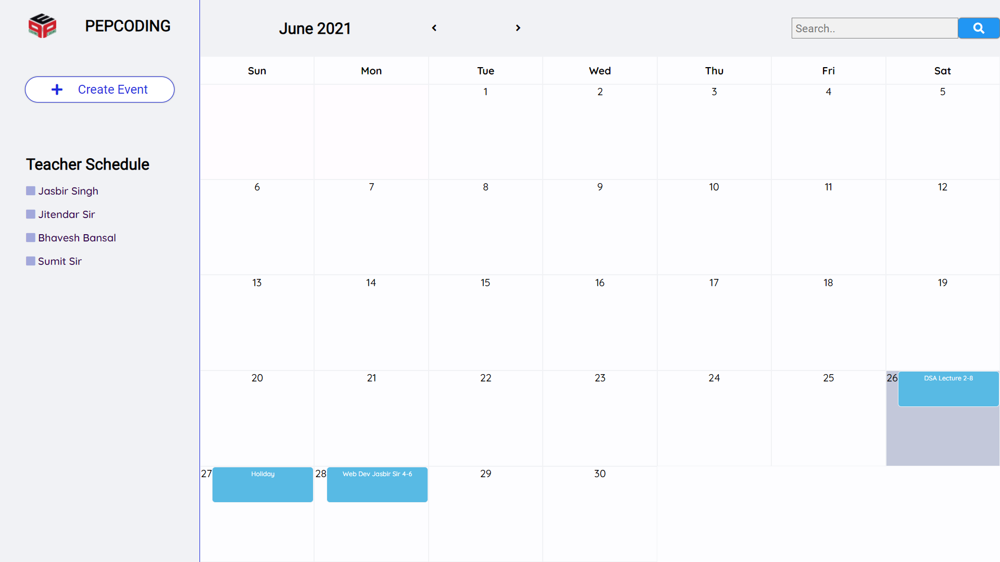
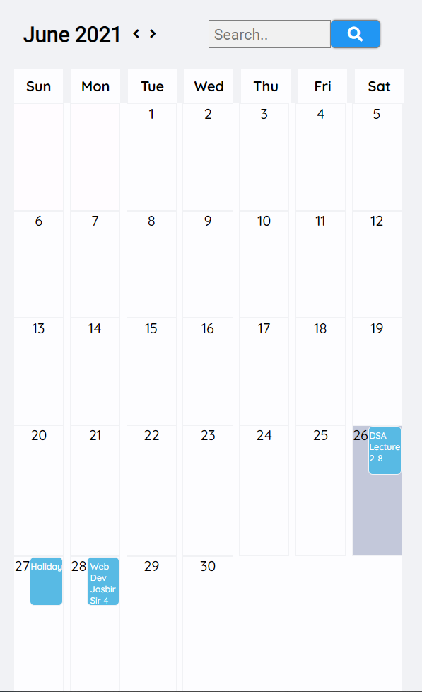

# EventScheduler

https://tender-lalande-44ec49.netlify.app/
<h4>Currently It has Only UI Section where event is currently stored In Local Storage</h4>
</h4>Database Design is in Excel File

<h2>Responsive mode</h2>

